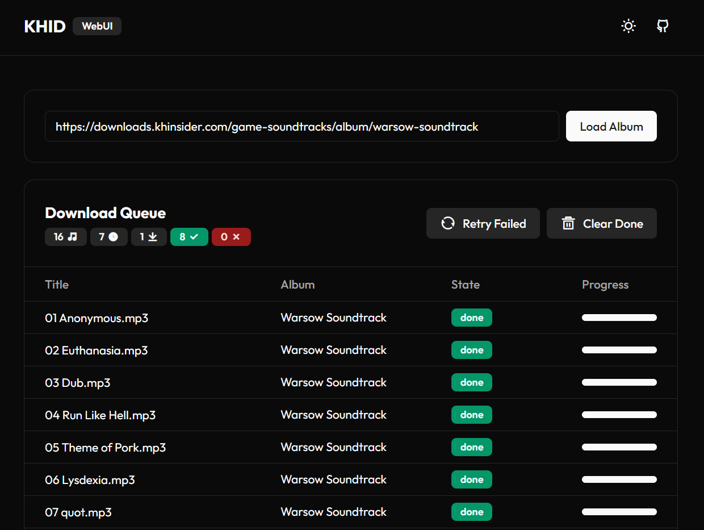

# KHInsider Downloader
## WebUI



A simple docker container & web UI to download media from downloads.khinsider.com

## Variables
| Variable        | Description                                              | Required | Default      |
|-----------------|----------------------------------------------------------|----------|--------------|
| OUTPUT_DIR      | The output directory for downloads. Can be a volume path | `no`     | Project root |
| REQUEST_TIMEOUT | Time until requests timeout                              | `no`     | 30 seconds   |

## Docker Compose
```yaml
services:
  server:
    image: "ghcr.io/laurawebdev/khid-docker:latest"
    environment:
      NODE_ENV: production
      OUTPUT_DIR: "/output"
      REQUEST_TIMEOUT: 30000
    volumes:
      - "./path/for/your/downloads:/output"
    ports:
      - "8080:8080"
```